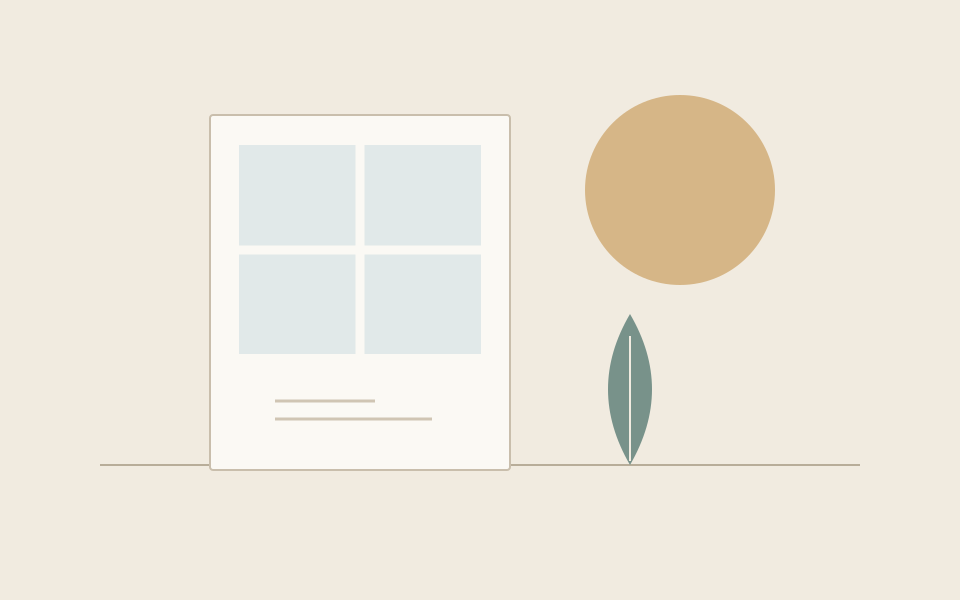

> **示例文章**：这是一篇版式样文，不代表站点作者真实经历。

## 不急着得出结论

有些想法适合写成清晰的步骤，另一些则需要一点空间。记下一个问题、一段观察，或者一句尚未展开的话，也是一种开始。

## 让阅读慢下来

一页文字不必占满屏幕。适当的行距、安静的颜色和清楚的层级，可以让读者把注意力交还给内容。

## 再回来看

记录不是一次完成的事情。旧文可以补充，想法可以修订。重要的是保留一条能够再次找到它们的路径。
