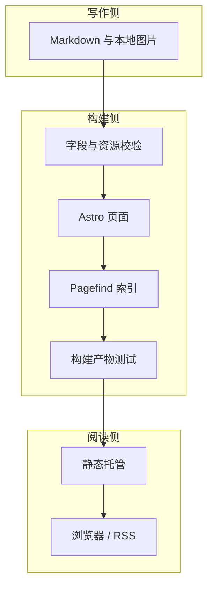

> **示例文章**：用于解释本站的目标架构，图中的部署流程不代表当前环境已经配置完成。

## 内容是系统的中心

文章保存在普通 Markdown 文件中。文件可以移动，标题可以修改，但显式的永久标识应该保持不变。

## 把职责分开

## 同一份产物，完成验证与发布

如果测试与发布各自构建一次，就可能得到不同的结果。更可靠的方式是验收即将发布的那份静态产物，不在发布前重新生成。

## 保持轻量

首版不引入数据库、账号或评论系统。把时间留给内容、阅读与必要的验证。
